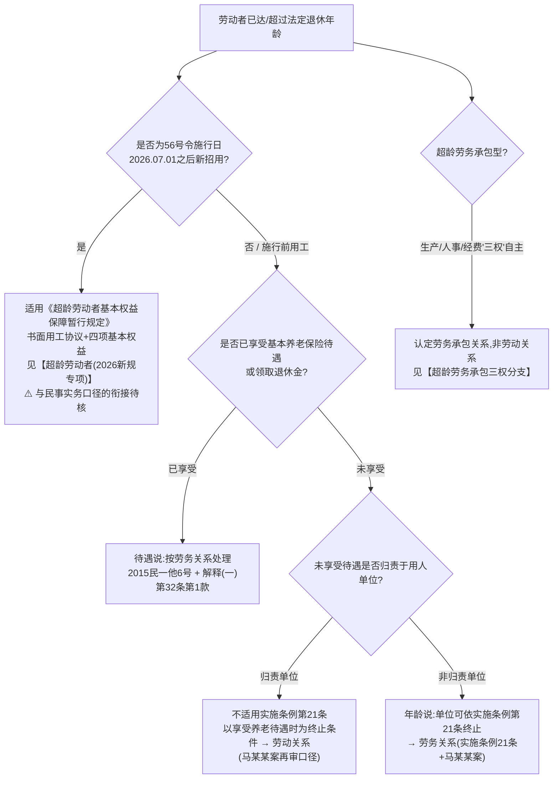

# 主体资格坑点清单

> 主题库#2 | 来源:课件1《劳动合同设计》P3-P12, P60-P61 + 《人民法院办理劳动争议案件实用手册》(人民法院出版社2024.12)、《劳动与社会保障法规汇编》(2026-09-03工具书蒸馏)
> 速查定位:争议轨labor-intake与顾问轨labor-contract-design共用

---

## [年龄下限:16周岁]

- 权威层级: 法律
- 属地: national
- 来源: 课件1 P3-P4
- 依据: 《劳动法》第十五条 + 第五十八条
- verified: pending

| 要点 | 内容 |
|------|------|
| 一般年龄下限 | **16周岁** |
| 未成年工 | 年满16未满18 |
| 例外行业 | 文艺、体育和特种工艺(招用未满16岁的,必须遵守国家规定 + 保障义务教育权利) |
| 特殊保护 | 国家对女职工和未成年工实行特殊劳动保护 |

⚠️ **坑点**:集团下属不同业态(演艺/体育/普通岗)需分别核验年龄段;招用未满16岁的,以"童工"处理,触发《非法用工单位伤亡人员一次性赔偿办法》。

---

## [终止情形:开始享受养老保险待遇]

- 权威层级: 法律
- 属地: national
- 来源: 课件1 P5 + 《手册》P202-203、P213-214、P233-237(2026-09-03工具书蒸馏补强)
- 依据: 《劳动合同法》第四十四条(二)项 + 《劳动合同法实施条例》第二十一条 + (2022)新民再229号 + 〔2015〕民一他字第6号
- verified: 课件部分pending;补强部分 V1锚点核验通过 2026-09-03(工具书蒸馏)

两种触发劳动合同终止的情形:
1. 劳动者**开始依法享受基本养老保险待遇**的(《劳动合同法》第四十四条第二项);
2. 劳动者**达到法定退休年龄**的(《劳动合同法实施条例》第二十一条)。

⚠️ 实务观点:两层标准未必同步——达到退休年龄但未享受养老保险的,合同是否当然终止,实务存在争议;代理劳动者侧时建议优先核查是否已享受待遇再主张。

### 超龄双口径术语总览(2026-09-03工具书蒸馏补强)

- **年龄说**:《劳动合同法实施条例》第21条"劳动者达到法定退休年龄的,劳动合同终止"——司法实践以乌鲁木齐某物业诉马某某案((2022)新民再229号)为代表,但该案对第21条作**限缩审查**(见下);
- **待遇说**:最高法民一庭〔2015〕民一他字第6号答复——劳动关系终止"应当以劳动者是否享受养老保险待遇或者领取退休金为标准";
- **工伤线独立**:用人单位聘用的超龄进城务工**农民**,工作时间内因工作原因伤亡的,应适用《工伤保险条例》认定工伤(〔2012〕行他字第13号,不以享受养老待遇为前提)——劳动关系线与工伤线双轨并行,工伤待遇规则参见社保工伤规则表(另一主题库)。

### 归责二分规则(乌鲁木齐某物业诉马某某,案例库参考案例·新疆高院再审)

> 不应仅对劳动者年龄标准作形式审查,而应具体审查劳动者不能享受基本养老保险待遇的原因是否与用人单位有关:非因用人单位原因不能享受待遇的,用人单位依《劳动合同法实施条例》第21条享有终止权利,形成劳务关系;因用人单位原因不能享受待遇的,不能适用该条,以享受养老保险待遇时为终止条件,形成劳动关系。

- 要点:①超龄用工按"**未享受待遇的原因是否归责单位**"二分,不搞年龄形式审查;②单位无过错(劳动者自行参保缴费不足等)→单位可终止,形成劳务关系;③适用边界:入职时已超龄且单位对未享受待遇无过错;在职达到退休年龄的处理需另行判断。
- ⚠️ **警示**(S-CE4):本案一二审按年龄说径行认定劳务关系,被**再审撤销**——"超龄未享受待遇"不能简单反推劳务关系;实施条例第21条的适用以"未享受待遇不可归责于单位"为边界。

### 超龄双口径决策树(冲突决议第1条拼树)

三种口径的适用时序(缩进列表版):
- **2015民一他6号(待遇说)**:以"是否享受养老保险待遇/退休金"为终止标准——民一庭答复口径,已由解释(一)第32条第1款定型化(该款废止衔接见[解释(一)第26-32条]条目警示);
- **实施条例第21条(年龄说)+马某某案**:达龄即终止,但对"未享受待遇"者须叠加审查"未享受原因是否归责单位",归责单位的不得径行终止;
- **56号令(2026.07.01施行)**:施行后**新招用**超龄劳动者→书面用工协议+四项基本权益(劳动报酬/休息休假/劳动安全卫生/工伤保障);**⚠️ 56号令施行后新招用超龄者与上述民事实务口径的衔接待核,本决策树不预判**(时间效力红线)。

---

## [超龄劳动者(2026新规专项)]

- 权威层级: 行政法规
- 属地: national
- 来源: 课件1 P6、P61 + 《汇编》P151-152(2026-09-03工具书蒸馏补强)
- 依据: 《超龄劳动者基本权益保障暂行规定》(人社部令第56号,2026.07.01施行)+ 国务院办法第6-7条
- verified: 课件部分pending;补强部分 V1锚点核验通过 2026-09-03(工具书蒸馏)

### 适用范围(第二条)
- 用人单位招用超过法定退休年龄的劳动者(**超龄劳动者**);
- 超龄劳动者受用人单位劳动管理、从事用人单位安排的有报酬的劳动;
- 已提前退休的劳动者被招用,亦适用本规定。

### 基本权益保障(第五条)
- 用人单位义务:获得劳动报酬、休息休假、劳动安全卫生、**工伤保障**等基本权益;
- 超龄劳动者义务:遵守职业道德和劳动规章制度、执行安全生产和职业卫生规程、完成劳动任务。

### 协议形式(第六条)
- 应当与超龄劳动者**订立书面用工协议**;
- 协议应明确:协议期限、工作内容、工作地点、工作时间、休息休假、劳动报酬、社会保险、劳动保护、劳动条件、职业危害防护等事项。

### 位阶与衔接补强(2026-09-03工具书蒸馏)
- **国务院办法第6条**(经人大常委会批准,《汇编》P151-152):"用人单位招用超过法定退休年龄的劳动者,应当保障劳动者获得劳动报酬、休息休假、劳动安全卫生、工伤保障等基本权益"——与56号令第五条同四项,构成56号令的**位阶依据**;
- 同条配套:领取失业保险金且距法定退休年龄不足1年的人员,领取失业保险金期限延长至法定退休年龄,期间由**失业保险基金**按规定为其缴纳养老保险费;
- ⚠️ 法定退休年龄自2025.01.01起渐进延迟,"超龄"起算点逐年个体化(参见法律前沿追踪F5延迟退休三件套);56号令(2026.07.01施行)与F5形成"超龄规则双轨":F5管"何时退休/超龄起算",F1管"超龄后怎么用工"。

⚠️ **核心坑点**(起草/审查模式必须注意):超龄**不是劳动合同**而是**用工协议**;模板自动切换逻辑:
- 触发条件:年龄 ≥ 法定退休年龄(或已提前退休);
- 命名:`XX 用工协议` 而非 `劳动合同`;
- 争议处理适用本规定而非劳动合同法全体系;
- **不接受**:课课件提到"已提前退休的,退休后被用人单位招用的,依照本规定执行"——协议条款不得绕过工伤等基本权益。

---

## [超龄劳务承包"三权"分支]

- 权威层级: 案例库参考案例(再审)
- 属地: national
- 来源: 《手册》P237-239(2026-09-03工具书蒸馏)
- 依据: 侯某生等与江西某生态科技有限公司万年分公司劳动合同纠纷案(江西高院再审)
- verified: V1锚点核验通过 2026-09-03(工具书蒸馏)

> 区分自然人与用人单位的劳务承包合同是劳务关系还是劳动关系,应从双方权利义务的约定来看。自然人享受生产管理权、人事管理权和经费分配权,自行解决承包期间各项责任事故,在人事安排、工作安排、报酬分配等主要事务上不受用人单位支配的,不存在隶属关系,不属于劳动关系。签订劳务承包合同时已超过法定退休年龄,此前与用人单位也不存在劳动关系的,应认定合意是建立劳务承包关系。

- 实务要点:①劳务承包 vs 劳动关系看"**三权**"(生产管理权/人事管理权/经费分配权)归属;②超龄+此前无劳动关系→承包合意认定为劳务承包;③用人单位接手经营权不当然承继劳动关系。
- 适用边界:承包人自主经营、自主聘人、自负责任的模式;受管理、按月领薪的普通超龄用工适用[终止情形]条目的归责二分规则。
- ⚠️ **警示**(S-CE5):本案一审败、二审胜、再审反转——"三权自享"须有证据支撑,仅以"承包合同"之名不足以排除劳动关系。
- 参见:超龄工伤双层规则(人社部发〔2016〕29号)与浙江三分法落社保工伤规则表。

---

## [用人单位范围]

- 权威层级: 法律
- 属地: national
- 来源: 课件1 P7
- 依据: 《劳动合同法》第二条
- verified: pending

适用《劳动合同法》的用人单位:
- 企业
- 个体经济组织
- 民办非企业单位等组织

⚠️ 实务观点:国家机关、事业单位、社会团体与之建立劳动关系的劳动者,适用《劳动法》(参见《劳动合同法》第二条第二款)。

---

## [业委会:不属于劳动法调整范围]

- 权威层级: 司法判例
- 属地: national(以"官某案"为代表)
- 来源: 课件1 P8 + 《汇编》P645、P657(2026-09-03工具书蒸馏补强)
- 依据: 《民法典》第九十六条 + 司法实践 + 浙江解答(三)问一/解答(五)问十五
- verified: 课件部分pending;补强部分 V1锚点核验通过 2026-09-03(工具书蒸馏)

⚠️ **判决要点**(课件引):业委会属于不符合参加社会保险主体资格单位,无法进行参加社会保险登记。故**官某与A业委会之间形成的工作关系,不属于劳动法调整的范围**。

《民法典》第九十六条:本节规定的机关法人、农村集体经济组织法人、城镇农村的合作经济组织法人、基层群众性自治组织法人,为**特别法人**。
- 基层群众性自治组织法人 = 居委会、村委会、**业委会**(性质同质)。

### 村居委/业委会口径演进(2026-09-03工具书蒸馏补强,冲突决议#3:并存+标注演进,以新为准)

- **2015口径**(浙江解答(三)问一):村民委员会、居民委员会、业主委员会等群众性自治组织均不属于《劳动合同法》第二条及实施条例第三条的用人单位,不构成劳动关系;
- **2017.10.01**:《民法总则》施行,基层群众性自治组织取得特别法人资格;
- **2019口径**(浙江解答(五)问十五):因特别法人制度,**村民委员会、居民委员会可以作为用人单位**,其与**对外聘用**人员发生的用工关系符合劳动关系特征的,按劳动关系处理;
- **业委会未在2019更新之列,仍倾向不认定**(与上列课件判例口径互证)。
- ⚠️ 时间线:2015口径 → 民法总则2017.10.01 → 2019修正口径。代理村居委聘用人员案件,先核**用工发生时点**与属地现行口径;2019口径限"对外聘用",村民自治用工仍需个案判断。
- 联动:下方[劳动关系三要素]条目之"村级巡防队员"场景,2019后村委会的主体资格障碍在浙江已扫清,比对重心移向劳动管理/报酬/业务组成三要素。

---

## [劳动关系三要素(劳社部发〔2005〕12号)]

- 权威层级: 部委规章
- 属地: national
- 来源: 课件1 P9 + 《汇编》P135-136(2026-09-03工具书蒸馏补强)
- 依据: 《关于确立劳动关系有关事项的通知》第一至四条
- verified: 课件部分pending;补强部分 V1锚点核验通过 2026-09-03(工具书蒸馏)

未订立书面劳动合同,但同时具备下列情形的,**劳动关系成立**:
1. **用人单位和劳动者**符合法律、法规规定的主体资格;
2. 用人单位依法制定的各项**劳动规章制度适用于劳动者**,劳动者受用人单位的**劳动管理**,从事用人单位安排的**有报酬**的劳动;
3. 劳动者提供的劳动是用人单位**业务的组成部分**。

### 第2-4条补强(2026-09-03工具书蒸馏)
- **凭证单位举证硬规则**:工资支付记录、招用记录(登记表)、考勤记录由**用人单位**负举证责任,劳动者只须提供工作证/服务证/其他劳动者证言等——举证细则参见举证责任分配表(另一主题库);
- **单位提出终止也补偿**:未订书面合同经通知补签、协商不成的,任何一方均可提出终止劳动关系;**用人单位提出终止**的,按劳动者本单位工作年限每满一年支付一个月工资的经济补偿金(早期"终止也补偿"的规则渊源);
- **发包方用工主体责任**:工程/业务/经营权发包给不具备用工主体资格的组织或自然人的,由**具备用工主体资格的发包方**承担用工主体责任(转包链条工伤责任之源,展开见下方【挂靠/转包】小节);
- 符合无固定期限条件而**劳动者提出**的,单位应当订立无固定期限劳动合同。

### [村级巡防队员 vs 村委会的关系认定]
- 来源: 课件1 P9(互动问题)+ 2019浙江口径补强
- 依据: 实务需逐项对照三要素
- verified: pending(补强部分 V1锚点核验通过 2026-09-03)

是否构成劳动关系,需逐要素核查:
- 主体资格:村委会是否能成为用人单位?——2019浙江口径(解答(五)问十五)后,**对外聘用**场景村委会可作用人单位(见[业委会]条目口径演进);2019前用工或非浙江属地仍存争议;
- 劳动管理:是否受村委会制定制度约束、有考勤等;
- 报酬特征:是否有持续、有对价的报酬(补贴vs劳务对价);
- 业务组成:巡防是否属于村委会业务(综治维稳类)。

⚠️ **口径参考**:多数实务观点倾向认为"村级巡防队员"如满足上述三要素则构成劳动关系,但**仍须逐案比对**(不在本主题库做一刀切结论)。

---

## [公司(筹)是否可以是用人单位]

- 权威层级: 法律待补
- 属地: national
- 来源: 课件1 P10(互动问题未答)
- 依据: 待补充
- verified: pending

**互动页(课件未给结论)**:公司(筹)可以作为用人单位吗?如果签订了劳动合同,双方建立什么关系?
- **结论状态**:依据待补充,本系统不编造答案。建议下游使用时核对属地工商登记+用工主体理论,不直接得出"当然无效"或"当然有效"。

---

## [非法用工(无证照单位伤亡)]

- 权威层级: 部委规章
- 属地: national
- 来源: 课件1 P11 + 《汇编》P354-355(2026-09-03工具书蒸馏补强)
- 依据: 《非法用工单位伤亡人员一次性赔偿办法》(2011.01.01施行版)第二条、第三条
- verified: 课件部分pending;补强部分 V1锚点核验通过 2026-09-03(工具书蒸馏)

### 适用范围
- 无营业执照或者未经依法登记、备案的单位;
- 被依法吊销营业执照或者撤销登记、备案的单位;
- 用人单位使用童工造成的伤残、死亡。

### 一次性赔偿范围
- 受伤职工在**治疗期间的费用**;
- **一次性赔偿金**(在治疗期满或死亡 / 劳动能力鉴定后确定数额)。

### 鉴定程序
- 劳动能力鉴定按**属地原则**由单位所在地设区的市级劳动能力鉴定委员会办理;
- 鉴定费用由伤亡职工或童工所在单位支付。

### 2011版精确倍数(2026-09-03工具书蒸馏补强)
- 伤残赔偿倍数(基数=单位所在工伤保险**统筹地区上年度职工年平均工资**):一级16 / 二级14 / 三级12 / 四级10 / 五级8 / 六级6 / 七级4 / 八级3 / 九级2 / 十级**1倍**;
- **死亡**:一次性赔偿金=上一年度全国城镇居民人均可支配收入的**20倍** + 按**10倍**一次性支付丧葬补助等其他赔偿金;
- 治疗期间:生活费按统筹地区上年度职工月平均工资;医疗费/护理费/伙食补助/交通费按《工伤保险条例》标准,均由单位支付;
- 拒付→人社部门责令限期改正;数额争议按劳动争议程序处理(仲裁前置可用的少见场景)。
- 完整框架与社保工伤交叉参见社保工伤规则表(另一主题库)。

⚠️ 实务观点:**非法用工 ≠ 劳动关系不存在**;用人单位仍承担赔偿义务,且赔偿标准通常高于工伤保险。

---

## [分公司能否成为用人单位]

- 权威层级: 法律待补
- 属地: national
- 来源: 课件1 P12(问题页)
- 依据: 待补充
- verified: pending

**互动页(课件未给结论)**:分公司能否成为用人单位?
- **结论状态**:依据待补充,本系统不编造答案。建议代理实务中**默认采纳"分公司可以作为用工主体,法律责任由总公司承担"的实务口径**,但具体争议时仍应核对属地裁判口径。

---

## 【平台用工/新业态】(2026-09-03工具书蒸馏新增小节)

> 收纳《手册》劳动关系确认案例群(指导案例237-240号+案例库骑手/主播/快递/平台四案)+浙江新就业形态细则;政策源与裁判框架总览参见法律前沿追踪F6,考勤/算法定额指标参见考勤制度坑点清单。

### [新就业形态(术语卡)]

- 权威层级: 最高法司法文件(法发〔2022〕36号)+ 指导性案例237-240号集群
- 属地: national
- 来源: 《手册》P188-190、P223-231(2026-09-03工具书蒸馏)
- 依据: 《最高人民法院关于为稳定就业提供司法服务和保障的意见》第6-9条;指导案例237-240号
- verified: V1锚点核验通过 2026-09-03(工具书蒸馏)

> 人民法院应当根据用工事实和劳动管理程度,综合考虑劳动者对工作时间及工作量的自主决定程度、劳动过程受管理控制程度、是否需遵守有关工作规则、劳动纪律和奖惩办法、工作持续性、能否决定或改变交易价格等因素,依法审慎予以认定。

⚠️ 通俗句:平台用工(骑手/主播/代驾等)是不是劳动关系,不看合同叫什么名字,看平台对"人"的管束程度——排班、派单、奖惩、价格自主权逐项过筛。

### [支配性劳动管理(术语卡)]

- 权威层级: 指导性案例裁判要点级(238/239/240号反复使用)
- 属地: national
- 来源: 《手册》P226-230(2026-09-03工具书蒸馏)
- 依据: 指导案例238号圣某欢案、239号网络主播王某案、240号代驾司机秦某丹案裁判理由
- verified: V1锚点核验通过 2026-09-03(工具书蒸馏)

> 劳动关系的本质特征是支配性劳动管理,即劳动者与用人单位之间存在较强的人格从属性、经济从属性、组织从属性(238号)。平台基于维护平台正常运营……采取的必要运营管理措施,不属于支配性劳动管理(240号)。

- "管人 vs 管单"对照:封号、扣金币、着装抽查等**运营风控≠**支配性管理;排班考勤、惩戒处罚、决定"干不干、多少钱干"**=**支配性管理。

### [不完全符合确立劳动关系情形(术语卡)]

- 权威层级: 经国务院同意的部委规范性文件(人社部发〔2021〕56号)
- 属地: national
- 来源: 《手册》P198-199(2026-09-03工具书蒸馏)
- 依据: 《关于维护新就业形态劳动者劳动保障权益的指导意见》第(一)(二)项
- verified: V1锚点核验通过 2026-09-03(工具书蒸馏)

三分法中间形态:①符合确立劳动关系→订立劳动合同;②**不完全符合确立劳动关系但企业进行劳动管理→订立书面协议**(中间形态);③个人依托平台自主经营/自由职业→按民事法律调整。
- ⚠️ 中间形态不是独立法定关系类型,权益按个案协议+劳动管理程度拼合,**不自动享有全部劳动基准**;不得反推"平台用工默认落入中间形态"。
- 参见:政策原文见法律前沿追踪F6;浙江细则见下方浙江新就业形态条目。

### [指导案例237号·郎溪外包诉徐某申(新业态骑手认定劳动关系)]

- 权威层级: 指导性案例(2024.12.20发布,应当参照)
- 属地: national
- 来源: 《手册》P223-225(2026-09-03工具书蒸馏)
- 依据: 指导性案例237号"郎溪某服务外包有限公司诉徐某申确认劳动关系纠纷案"
- verified: V1锚点核验通过 2026-09-03(工具书蒸馏)

> 平台企业或者平台用工合作企业与劳动者订立承揽、合作协议,劳动者主张存在劳动关系的,应当根据用工事实,综合考虑劳动者对工作时间及工作量的自主决定程度、劳动过程受管理控制程度、是否需遵守工作规则、算法规则、劳动纪律和奖惩办法、工作持续性、能否决定交易价格等因素依法认定。存在用工事实,构成支配性劳动管理的,应当依法认定存在劳动关系。

- 实务要点:①书面"承揽/合作协议"**不能阻却**劳动关系认定,以用工事实穿透审查;②五因素:工时工作量自主度、受管控程度、规则纪律奖惩约束、持续性、价格决定权;③排班打卡+系统派单+基本报酬/按单计酬/奖励的报酬结构→认定劳动关系。
- 适用边界:须有实际用工事实且构成支配性管理;从业者自主接单、自定时间、议价权强的(239/240号情形)不适用;本案系工伤认定衍生。
- **双版本注**(S-CA5):同案案例库入库版"某服务外包公司诉徐某"(《手册》P232-233)要旨——按"**实际权利义务内容**"审查,以劳动关系从属性为内在核心评判基准;转账摘要"工资网上代发代扣"等履行痕迹具证明力;协议名称与实际履行不符时两版互证。

### [指导案例238号·圣某欢("假个体户+假转包"穿透)]

- 权威层级: 指导性案例(2024.12.20发布)
- 属地: national
- 来源: 《手册》P225-227(2026-09-03工具书蒸馏)
- 依据: 指导性案例238号"圣某欢诉江苏某网络科技有限公司确认劳动关系纠纷案"
- verified: V1锚点核验通过 2026-09-03(工具书蒸馏)

裁判要点:①平台要求劳动者**注册为个体工商户**后再签承揽、合作协议,存在用工事实构成支配性劳动管理的,依法认定劳动关系——"个体工商户化"是规避手段;②主营业务存在**转包**的,根据用工事实和劳动管理程度,结合**实际用工管理主体、劳动报酬来源**,认定劳动者与其关系最密切的企业建立劳动关系。
- ⚠️ 坑点:站点授权注册、派单不可拒、请假扣奖励、薪资规则由平台制定=支配性管理。
- 适用边界:转包须系"名义流转"、实际管理与结算仍在原企业;若转包方真实接管管理,则与转包方建立关系。

### [指导案例239号·王某(网络主播排除劳动关系)]

- 权威层级: 指导性案例(2024.12.20发布)
- 属地: national
- 来源: 《手册》P228-229(2026-09-03工具书蒸馏)
- 依据: 指导性案例239号"王某诉北京某文化传媒有限公司劳动争议案"
- verified: V1锚点核验通过 2026-09-03(工具书蒸馏)

> 经纪公司对从业人员的工作时间、工作内容、工作过程控制程度不强,从业人员无需严格遵守公司劳动管理制度,且对利益分配等事项具有较强议价权的,应当认定双方之间不存在支配性劳动管理,不存在劳动关系。

- 要点:①区分"经纪履约要求"与"劳动管理":按约到场履约≠服从劳动纪律;②收益分成议价权强=平等合作关系;③合同目的为孵化影响力并按约分成,不具有劳动合同要素。
- 适用边界:仅限控制弱+议价强的经纪合作模式;受排班考勤、领底薪的全职主播不适用。

### [指导案例240号·秦某丹(代驾司机"必要运营管理"排除)]

- 权威层级: 指导性案例(2024.12.20发布)
- 属地: national
- 来源: 《手册》P230-231(2026-09-03工具书蒸馏)
- 依据: 指导性案例240号"秦某丹诉北京某汽车技术开发服务有限公司劳动争议案"
- verified: V1锚点核验通过 2026-09-03(工具书蒸馏)

> 平台企业或者平台用工合作企业为维护平台正常运营、提供优质服务等进行必要运营管理,但未形成支配性劳动管理的,对于劳动者提出的与该企业之间存在劳动关系的主张,人民法院依法不予支持。

- 要点:①**必要运营管理**(购工服、软件培训、路考、仪容抽查、金币奖惩、风控封号)≠支配性劳动管理;②自主决定是否注册/上线/抢单+报酬由用户直接支付→无从属性;③平台仅充当中间信息服务方。
- 适用边界:关键事实是工时工作量自主权与报酬来源;若平台排班考勤+保底底薪,结论可能反转。

### [何某诉某商务服务公司("四不影响"清单+三步穿透进路)]

- 权威层级: 案例库参考案例(广州中院二审改判)
- 属地: national
- 来源: 《手册》P247-250(2026-09-03工具书蒸馏;框架辅P232-233、P259-261)
- 依据: 何某诉某商务服务公司、某商务服务公司广州分公司确认劳动关系纠纷案;辅:某服务外包诉徐某案、指导案例179号
- verified: V1锚点核验通过 2026-09-03(工具书蒸馏)

> 劳动者人格及经济从属性是认定劳动关系最核心的标准。……从业者应平台企业要求注册个体工商户、自备部分生产资料、薪酬由其他主体代发、双方事先对身份关系性质进行约定等均不影响劳动关系的认定。

- **"四个不影响"**:①注册个体工商户 ②自备部分生产资料 ③薪酬第三方代发 ④事先约定排除劳动关系——均不阻断劳动关系认定;
- **三步穿透进路**(S-FW1框架):①不看合同名称与事先约定(承揽/合作/合伙/"个体户注册"),直接进入用工事实;②按"实际权利义务内容"逐项审查:管理要求(排班考勤、接单自由度、奖惩)、报酬组成与发放(工资性质、是否主要生活来源、是否持续稳定)、劳动是否业务组成部分、核心生产资料由谁提供;③以人格+经济从属性(辅以组织从属性)的有无强弱定性;
- 辅助要点:排他性条款(禁多平台)+不上线即罚款,支持从属性;多层发包中"名义转包方"仅系代付主体的,穿透至实际管理企业;工伤医疗期内不得解除。
- 适用边界:全职骑手受排班、考勤、罚款管理的场景;自主抢单众包、报酬来自用户直付的不适用(见240号)。**反面效果**(指导案例179号):协议含劳动合同法第17条必备条款且已履行的,可视为书面劳动合同,阻却二倍工资——参见合同条款设计要点(另一主题库)。

### [李某诉某文化传播公司(主播合作协议排除)]

- 权威层级: 案例库参考案例
- 属地: national
- 来源: 《手册》P239-240(2026-09-03工具书蒸馏)
- verified: V1锚点核验通过 2026-09-03(工具书蒸馏)

三层面审查:①管理方式(无考勤排班);②收入分配(打赏分成非劳动报酬);③工作内容(直播非公司业务组成)。主播自定直播内容/时长/时段为关键事实。
- 与239号互证:经纪型合作排除劳动关系的早期正典判例(第三方平台打赏分成模式)。

### [陈某某诉辽源某物流("快递小哥"从属性认定)]

- 权威层级: 案例库参考案例
- 属地: national
- 来源: 《手册》P242-244(2026-09-03工具书蒸馏)
- verified: V1锚点核验通过 2026-09-03(工具书蒸馏)

- 要点:①招聘广告承诺"可缴纳社保"=建立劳动关系的**意思表示证据**,事后抗辩承揽系对招聘承诺的否定;②管理人员朋友圈招聘属职务行为;③计件无保底、自带车辆、按片区管理**不排除从属性**;④支持未签书面合同二倍工资。
- 适用边界:从属性事实充分且有意思表示证据(招聘广告/聊天记录);纯粹众包抢单模式不适用。

### [浙江新就业形态实施办法(三类分层+"假个体户"穿透)]

- 权威层级: 地方性文件(省政府同意的多部门联合办法)
- 属地: zhejiang
- 来源: 《汇编》P140-141(2026-09-03工具书蒸馏)
- 依据: 《浙江省维护新就业形态劳动者劳动保障权益实施办法》(2021.12.01施行)第2、4、6-8、10条
- verified: V1锚点核验通过 2026-09-03(工具书蒸馏)

> 企业对不完全符合确立劳动关系情形的劳动者进行劳动过程管理……应当与其订立书面协议,合理确定双方的权利义务。企业与劳动者约定其以个体经营者身份完成工作,但对劳动者进行劳动过程管理的,根据用工事实界定成立劳动关系或者不完全符合确立劳动关系情形。

- 要点:①三类分层:劳动关系→劳动合同;不完全符合确立劳动关系→**必须书面协议**;纯自主经营/自由职业→民事法律调整;②**"假个体户"穿透**:约定个体户身份+实际劳动过程管理→按用工事实定性,强制注册个体户无效;③三禁止:不得收取保证金押金、不得违法限制多平台就业、不得设置歧视性条件(第4条);④平台须书面/口头**告知拟建立的法律关系**并明确说明,协议须汇聚至省电子合同在线平台统一监管(第10条)。
- 参见:平台合作用工责任阶梯与算法硬指标(连续在线>4小时≥20分钟工间休息/定额90%可完成)落考勤制度坑点清单;单险种工伤保险落社保工伤规则表。

---

## 【挂靠/转包】(2026-09-03工具书蒸馏新增小节)

> 劳动关系认定与责任承担分离是本节主线;工伤责任链(转包工伤责任/劳动关系争议中止)落社保工伤规则表,此处仅作"参见"指引。

### [船舶挂靠船员×货车挂靠司机(挂靠双案例)]

- 权威层级: 案例库参考案例(广州海事法院/河北高院再审)
- 属地: national
- 来源: 《手册》P244-247、P256-257(2026-09-03工具书蒸馏)
- 依据: 陈某诉广州某某船务公司船员劳动争议案;滦县某物流公司诉王某劳动争议案
- verified: V1锚点核验通过 2026-09-03(工具书蒸馏)

**船员案**(陈某诉广州某船务):
- ①违法挂靠不能成为船员与被挂靠公司劳动关系成立的依据——**行政违法与劳动关系认定分离**;
- ②凭证印章来源实质审查:私自刻制加盖的船章/船员服务部签证章**无证明力**;
- ③招用商谈、在船管理、报酬支付与调整主体是谁,即与谁成立劳务关系;若凭证、工资均由被挂靠公司发放,可认定事实劳动关系。

**货车挂靠案**(滦县某物流诉王某):
- ①工伤保险责任条款(工伤行政规定第3条第1款第5项)宗旨在于保护劳动者权益,**不能反向推定**劳动者与被挂靠企业存在劳动关系——**责任≠关系**;
- ②司机由实际经营人招用管理发薪、甚至不知被挂靠单位存在的,与被挂靠单位无劳动关系。

⚠️ **警示**(S-CE6):挂靠聘用人员主张与被挂靠单位劳动关系**败诉**——选错被告/选错请求路径即败诉;救济应转向实际经营人(劳务/雇佣路径)或工伤保险责任路径(行政,参见社保工伤规则表)。事实劳动关系凭证清单(招工登记表/工资单/考勤表/工作证/服务簿等)参见举证责任分配表。

### [违法转包/挂靠用工主体责任(解释(二)第1-2条)]

- 权威层级: 司法解释
- 属地: national
- 来源: 《汇编》P597(2026-09-03工具书蒸馏)
- 依据: 法释〔2025〕12号第1-2条(2025.09.01施行)
- verified: V1锚点核验通过 2026-09-03(工具书蒸馏)

> 具备合法经营资格的承包人将承包业务转包或者分包给不具备合法经营资格的组织或者个人,该组织或者个人招用的劳动者请求确认承包人为承担用工主体责任单位,承担支付劳动报酬、认定工伤后的工伤保险待遇等责任的,人民法院依法予以支持。

- 要点:①违法转包/分包情形下,劳动者可请求**有资质的承包人**承担用工主体责任(劳动报酬+认定工伤后的工伤保险待遇);②挂靠经营中,**被挂靠单位**同样承担用工主体责任;③⚠️ **"用工主体责任"≠确认劳动关系**——两概念分离。
- 判例锚点:薛某景诉新疆某建设公司(建筑施工违法转包,《手册》P252-255)——确认劳动关系不予支持,但工伤保险责任成立;垫付的非因工伤医疗费可返还(展开落社保工伤规则表)。
- 适用边界:2025.09.01起施行;限"不具备合法经营资格"的转包/挂靠对象。

### [建筑违法转包等四情形(浙江解答(二)问一-四)]

- 权威层级: 地方裁判口径
- 属地: zhejiang
- 来源: 《汇编》P639-640(2026-09-03工具书蒸馏)
- 依据: 浙高法民一〔2014〕7号问一-四
- verified: V1锚点核验通过 2026-09-03(工具书蒸馏)

- ①**建筑违法转包**:不确认与承包单位的劳动关系,但人员伤亡的,请求承包单位"参照工伤"规定赔偿的应予支持(与解释(二)第1-2条责任链互链);
- ②**在职职工另谋兼职**:与后一单位成立劳动关系,劳动报酬/经济补偿/休息休假权均可主张;
- ③**"包厨"**:内部职工承包→与饭店成立劳动关系;外部招用只受承包人管理→与饭店无劳动关系;
- ④**快递员、促销员包片/委托协议形式**:名义按约定,但符合"受管理+有报酬+业务组成"三要件仍认定劳动关系。
- 与劳社部发〔2005〕12号三要素配合使用;系新就业形态认定的浙江先声。

---

## 【特殊主体与用工形态】(2026-09-03工具书蒸馏新增小节)

### [外国人劳动关系(解释(二)第4-5条)]

- 权威层级: 司法解释
- 属地: national
- 来源: 《汇编》P597-598(2026-09-03工具书蒸馏)
- 依据: 法释〔2025〕12号第4-5条(2025.09.01施行)
- verified: V1锚点核验通过 2026-09-03(工具书蒸馏)

> 外国人……有下列情形之一,请求确认与用人单位存在劳动关系的,依法予以支持:(一)已取得永久居留资格的;(二)已取得工作许可且在中国境内合法停留居留的;(三)按照国家有关规定办理相关手续的。

- 要点:①三情形之一即可确认劳动关系;②外企常驻代表机构可作劳动争议**当事人**,并可申请追加外国企业参诉。
- ⚠️ **新法分界(2025.09.01,冲突决议#1改写)**:浙江"未取得就业证→劳动合同无效,仅参照约定付酬"旧口径(浙江高院意见(试行)第4条,2009)**自2025.09.01起被法释〔2025〕12号取代,仅作历史口径**,不得再作现行依据引用;港澳台人员免办就业证口径(人社部发〔2018〕53号)与本条方向一致,可并注。

### [关联单位混同用工(解释(二)第3条)]

- 权威层级: 司法解释
- 属地: national
- 来源: 《汇编》P597(2026-09-03工具书蒸馏)
- 依据: 法释〔2025〕12号第3条(2025.09.01施行)
- verified: V1锚点核验通过 2026-09-03(工具书蒸馏)

> 劳动者被多个存在关联关系的单位交替或者同时用工……(一)已订立书面劳动合同,劳动者请求按照劳动合同确认劳动关系的,依法予以支持;(二)未订立书面劳动合同的,根据用工管理行为,综合考虑工作时间、工作内容、劳动报酬支付、社会保险费缴纳等因素确认劳动关系。

- 要点:①有书面合同**从合同**;无合同按用工管理行为**四因素**综合认定;②可请求关联单位**共同承担**劳动报酬、福利待遇责任;③**关联单位间有约定且经劳动者同意的除外**(新细节)。
- 参见:混同用工的实务运用(连带责任的谈判工具视角)见法律前沿追踪F4;条文展开见法律前沿追踪F2第3条分节。

### [股东/合伙人/母派子公司等特殊主体(浙江解答(五)问一-五)]

- 权威层级: 地方裁判口径
- 属地: zhejiang
- 来源: 《汇编》P654-655(2026-09-03工具书蒸馏)
- 依据: 浙高法民一〔2019〕1号问一-五
- verified: V1锚点核验通过 2026-09-03(工具书蒸馏)

- ①**股东、合伙人**与劳动者身份原则上不矛盾——按管理从属性+股权比例+章程+提供劳动综合认定;
- ②**母派子公司**任法定代表人/总经理:有书面合同从合同;无合同的按社保/工资/工作地点综合认定(符合意见(试行)第7条的母子公司连带);
- ③**非因本人原因流动**:原单位工龄与订立劳动合同**次数合并计算**→满10年/两次可主张与新单位订无固定(与解释(二)第10条(三)项呼应);
- ④**派遣单位**除协商一致外无订立无固定期限合同义务(劳务派遣特别规定优先);
- ⑤履职致损属经营风险一般不赔,**故意或重大过失**才赔,数额综合过错原因力/损失/报酬水平酌定。

### [浙江高院意见(试行)主体资格规则群(2009)]

- 权威层级: 地方司法口径
- 属地: zhejiang
- 来源: 《汇编》P614-616(2026-09-03工具书蒸馏)
- 依据: 浙法民一〔2009〕3号第2-11条(与浙劳仲〔2009〕2号第2-14条同源,二选一收录,此处注明双出处)
- verified: V1锚点核验通过 2026-09-03(工具书蒸馏)

- ①**住房公积金争议不属于劳动争议**;
- ②**达龄雇佣**:达到法定退休年龄后用工按雇佣关系;未达龄**内退者**与新单位一般按劳动关系,但社保已由原单位缴的不得要求新单位重复缴;
- ③外企代表机构直接招用按雇佣关系;**在校学生实习**受伤按雇佣关系处理;
- ④**指派用工、挂靠借照、建工层层转包**:指派单位和实际用工单位/挂靠双方/发包承包方作**共同当事人并承担连带责任**;吊销/解散的列清算组织,不能担责的追加出资人/开办单位。
- ⚠️ **新法分界**:本意见外国人条款(第4条"未办就业证合同无效")自2025.09.01**让位**于解释(二)第4条(见上方外国人条目);其余主体规则总体仍被参照。

### [退役军人主体资格]

- 权威层级: 案例库参考案例
- 属地: national
- 来源: 《手册》P240-241(2026-09-03工具书蒸馏)
- 依据: 孙某诉某装饰公司劳动争议纠纷案
- verified: V1锚点核验通过 2026-09-03(工具书蒸馏)

> 尚未达到法定退休年龄及未享受养老保险待遇的自主择业退役军人,具有成立劳动关系的法定主体资格。用人单位与劳动者签订书面劳动合同的法定义务不因其对劳动者身份的认知混淆而免除。

- 要点:①**领取退役金≠享受养老保险待遇**,仍有劳动关系主体资格且可参加社保;②"以为是退休返聘"的**身份认知混淆不免除**未签合同二倍工资责任;③单位不提供工资清单、考勤记录的,承担举证不能后果(月工资按劳动者主张认定)。
- 适用边界:以未达退休年龄、未享受养老保险待遇为前提;已退休返聘的退役军人不适用。

### [解释(一)第26-32条:退休定性与当事人列置]

- 权威层级: 司法解释
- 属地: national
- 来源: 《手册》P175-176(2026-09-03工具书蒸馏)
- 依据: 《劳动争议解释(一)》第26-31条、第32条
- verified: V1锚点核验通过 2026-09-03(工具书蒸馏)

> 第32条:用人单位与其招用的已经依法享受养老保险待遇或者领取退休金的人员发生用工争议而提起诉讼的,人民法院应当按劳务关系处理。企业停薪留职人员、未达到法定退休年龄的内退人员、下岗待岗人员以及企业经营性停产放长假人员,因与新的用人单位发生用工争议而提起诉讼的,人民法院应当按劳动关系处理。

- 要点:①退休定性以"**是否享受养老保险待遇/退休金**"为标准,而非年龄;②**四类特殊人员**(停薪留职/未达龄内退/下岗待岗/经营性停产放长假)再就业按**劳动关系**处理;③当事人列置:合并→合并后单位;分立→实际用人单位,不明的分立各方均为当事人(26条);招用未解约劳动者,原单位争议可列新单位为第三人(27条);无照经营/吊销/期限届满仍经营→列出资人,挂靠经营→挂靠方+出借执照方共同列当事人(29、30条);仲裁遗漏必须参加的当事人→法院依追加并一并处理责任(31条)。
- 适用边界:第32条**不含**"超过退休年龄但未享受待遇"情形——该情形由[终止情形]条目的超龄双口径决策树拼接处理。
- ⚠️ **法条更替警示**:《解释(一)》第32条**第1款**已随解释(二)(法释〔2025〕12号,2025.09.01施行)**同时废止**(见法律前沿追踪F2第21条分节);本条目援引第32条整体内容的段落引用时须注意更替与衔接待核,待遇说基准仍可援引〔2015〕民一他字第6号答复。
- 参见:26-31条当事人细则副本落一裁终局与裁审衔接规则库。

### [用工形式:劳务派遣"三性"岗位]

- 权威层级: 法律 + 部门规章
- 属地: national
- 来源: 《手册》P16、P138(2026-09-03工具书蒸馏)
- 依据: 《劳动合同法》第66条;《劳务派遣暂行规定》第3、4条
- verified: V1锚点核验通过 2026-09-03(工具书蒸馏)

- 三性定义:**临时性**=存续时间不超过**6个月**的岗位;**辅助性**=为主营业务岗位提供服务的非主营业务岗位;**替代性**=劳动者因脱产学习、休假等原因无法工作期间可由他人替代的岗位;
- ⚠️ **程序要件**(库内空白本次补齐):用工单位决定使用**辅助性岗位**,应当经职工代表大会或者全体职工讨论+在用工单位内**公示**——缺民主程序与公示则"三性"失守;
- 用工比例(派遣用工不得超过用工总量10%,暂行规定第4条)与同工同酬规则参见合同条款设计要点(另一主题库)。

### [非全日制用工:三口径冲突与法定口径统一]

- 权威层级: 法律 + 部门规章 + 地方规定(counter_example)
- 属地: national(含zhejiang对照)
- 来源: 《汇编》P132、P138(2026-09-03工具书蒸馏)
- 依据: 劳社部发〔2003〕12号第1条;浙劳社劳薪〔2003〕155号第1条;对照《劳动合同法》第68条
- verified: V1锚点核验通过 2026-09-03(工具书蒸馏)

三口径并存:
- 劳社部发〔2003〕12号:日≤**5h** / 周≤**30h**;
- 《劳动合同法》第68条:日≤**4h** / 周累计≤**24h**;
- 浙江155号:同一单位日≤4h,多单位周累计≤**40h**。

⚠️ **口径统一(冲突决议:位阶解决,以法律为准)**:定性"是否非全日制"以**劳动合同法第68条(4h/24h)为唯一标准**;2003意见的5h/30h已被上位法事实超越,仅工伤缴纳、口头合同等**不冲突部分**仍有参照;浙江"多单位周累计≤40h"仅作管理参考,**不能突破24h法律上限**。

- 法定特殊规则(劳动合同法第68-72条):可订立口头协议;**不得约定试用期**;双方可随时通知终止用工且单位**不支付经济补偿**;小时计酬不得低于当地最低小时工资标准;报酬结算支付周期最长不超过**15日**;
- 社保要点:**工伤保险为唯一强制单位险种**;5-10级伤残经协商一致可一次性结算全部伤残待遇(全日制用工无此通道)——细则与全日制对照参见社保工伤规则表;
- 浙江补充(全日制在职工不得兼非全日制/招用备案等,2003年文件)参见浙江口径汇编,执行现状需核实现行经办口径。

---

## 【招聘环节合规】(2026-09-03工具书蒸馏新增小节)

> 候选曾拟"新库:招聘合规与平等就业",暂以本小节落于本库,后续条目增多可拆库。

### [平等就业权(指导案例185号·闫佳琳诉浙江喜来登)]

- 权威层级: 指导性案例(2022.7.4发布,应当参照)
- 属地: national
- 来源: 《手册》P308-309(2026-09-03工具书蒸馏)
- 依据: 指导案例185号"闫佳琳诉浙江喜来登度假村有限公司平等就业权纠纷案";《就业促进法》第3、26条
- verified: V1锚点核验通过 2026-09-03(工具书蒸馏)

> 用人单位在招用人员时,基于地域、性别等与"工作内在要求"无必然联系的因素,对劳动者进行无正当理由差别对待的,构成就业歧视,劳动者以平等就业权受到侵害,请求用人单位承担相应法律责任的,人民法院应予支持。

- 要点:①"**先赋因素**"(地域/户籍/性别/年龄/容貌等人力难以选择和控制)vs"**自获因素**"(专业/学历/经验/技能)二分法——以先赋因素差别对待=就业歧视;②责任:赔礼道歉+精神抚慰金+维权费用;侵害的是人格尊严(一般人格权);③就业促进法第3条"等"字为开放列举。
- ⚠️ **通道注**:就业歧视→**独立民事侵权之诉,不经仲裁前置**(平等就业权术语释义并入本条,不另立卡)。
- 适用边界:招录环节的差别对待;与"工作内在要求"有必然联系的限制(岗位真实职业需求)不构成歧视。

---

## 速查表:主体资格常见"坑"分类

| 主体类型 | 是否构成劳动关系 | 主要风险 | 处置建议 |
|---------|-----------------|---------|---------|
| 未满16周岁 | ✗(但文艺/体育/特种工艺例外) | 童工 = 行政处罚 + 非法用工赔偿 | 入职审核身份证 + 行业例外排除 |
| 16-18周岁 | ✓(未成年工特殊保护) | 不得从事矿山井下、有毒有害等 | 岗位匹配 + 体检登记 |
| 退休/超龄 | 先过超龄决策树:已享待遇→劳务;未享待遇按归责二分;56号令2026.07.01后新招用→用工协议(衔接待核) | 口径误用 + 绕过工伤等基本权益 | 见[终止情形]决策树 + 模板自动切换 |
| 超龄劳务承包 | ✗(三权自主→劳务承包) | 以承包之名行用工之实 | 核"生产/人事/经费"三权归属 |
| 业委会 | ✗(不属于劳动法调整范围) | 劳动者保护缺位 | 改以劳务/委托合同,明示法律关系 |
| 村委会/居委会(对外聘用) | ✓(2019浙江口径) | 2015旧口径误用 | 按用工时点与属地选口径,逐项比对三要素 |
| 平台骑手/网约工 | 视五因素+"四不影响"(237/238号/何某案) | "假个体户+假转包"被穿透 | 按用工事实逐项过筛 |
| 主播/经纪合作 | ✗(控制弱+议价强,239号) | 混同经纪履约与劳动管理 | 审查控制强度与报酬来源 |
| 代驾等必要运营管理 | ✗(240号) | 运营管理误当劳动管理 | 区分"管人 vs 管单" |
| 挂靠司机/船员 | ✗(与被挂靠单位) | 工伤责任≠劳动关系 | 向实际经营人/工伤责任路径主张 |
| 违法转包用工 | ✗(与发包方无劳动关系) | 用工主体责任(报酬+工伤待遇) | 请求有资质承包人担责(解释二1-2条) |
| 外国人 | ✓(永居/工作许可+合法停留/办妥手续) | 旧"就业证无效"口径已废 | 按2025.09.01解释(二)新口径 |
| 退役军人(领退役金) | ✓(未达龄未享待遇) | "身份误认"不免二倍工资 | 核退休与待遇状态 |
| 股东/合伙人 | 视管理从属性(浙江) | 身份混同 | 综合认定,浙江口径先行 |
| 非全日制 | ✓(法定口径4h/24h) | 三口径(5h/30h vs 4h/24h vs 40h)混用 | 以劳动合同法68条定性 |
| 筹建公司 | 待补 | 法律关系不明 | 不下结论,核对属地裁判 |
| 分公司 | 待补 | 责任归属不明 | 默认用工主体归分公司,责任由总公司承担 |
| 非法用工单位 | ✓(赔偿路径不同) | 一次性赔偿标准高(伤残16-1倍/死亡20倍+10倍) | 单独走《非法用工办法》 |
| 童工(<16) | ✗(劳动关系) | 高额赔偿 | 严禁招用 |

---

*本主题库条目:课件源条目按课件文字层提取,法条以课件呈现版摘录,**未经元典核验**(T3阶段统一处理);2026-09-03新增/补强条目来自《人民法院办理劳动争议案件实用手册》《劳动与社会保障法规汇编》工具书蒸馏,已通过V1锚点核验;实务观点以"⚠️ 实务观点,非法律依据"标注;涉及其他主题库的规则以"参见"指引,不重复承载。*
